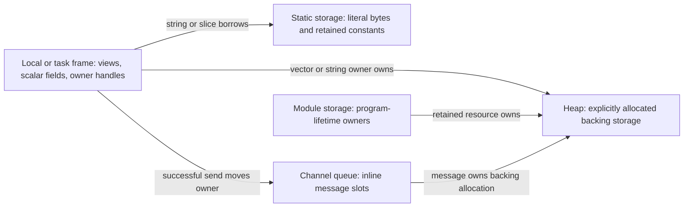
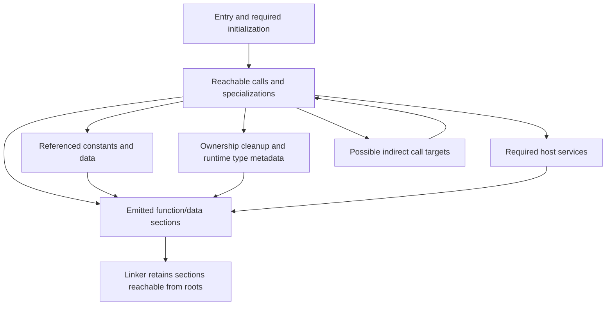

# Memory and binary optimization

[Documentation index](../README.md) · [Memory](memory.md) · [Modules and build inputs](modules-and-ffi.md) · [Manifest guide](../guide/mod.md)

A program's memory cost follows the owners that are alive together. Its executable
size follows the code and data reachable from the entry and required runtime
operations. The two graphs interact, but they measure different things: a tiny
binary can allocate a huge heap, and a large read-only dataset need not become a
private heap copy in every process.

This reference defines meowy's optimization contract, build settings, and evidence
for inspecting those graphs. The [ownership reference](memory.md) defines which
transformations remain legal. No optimization mode weakens bounds checks, checked
arithmetic, borrowing, task joins, or cleanup.

## Pick the budget you mean

| Budget                    | What it measures                                                              | Typical ways to reduce it                                                                                             |
| ------------------------- | ----------------------------------------------------------------------------- | --------------------------------------------------------------------------------------------------------------------- |
| Live application storage  | Inline owners and distinct backing allocations currently needed               | Bound inputs, shorten owner lifetimes, borrow existing data, stream work, release retained capacity.                  |
| Peak runtime memory       | Application storage plus runtime/allocator/OS costs during the worst overlap  | Limit admission and intermediate buffers; measure growth, slow consumers, and cleanup together.                       |
| Executable file bytes     | Code, initialized data, metadata, padding, and any embedded debug information | Remove unreachable code/data, select smaller algorithms, control specialization/inlining, separate debug information. |
| Installed runtime closure | Executable plus required shared libraries, loader, and application data       | Inspect actual dependencies; compare static and shared deployment as complete sets.                                   |
| Container image bytes     | Final image layers, compressed or unpacked according to the reported metric   | Copy only deployment artifacts; exclude toolchains, build caches, source, and diagnostic archives.                    |
| Build-time peak memory    | Compiler processes, IR, link state, and LTO backends                          | Limit build jobs and choose an appropriate LTO mode independently of runtime workers.                                 |

Choose a workload and a limit before optimizing. “No heap allocation,” “smallest
executable,” and “lowest peak memory” are different objectives. Record elapsed
time and throughput too: a smaller representation can require more decoding or
indirection, and a size-oriented optimizer can trade speed for fewer instructions.

## Follow a value through the program

Inline means **inside its owner**, not automatically on the stack. A record in a
vector's allocation stores its inline fields on that heap allocation. A bounded
list in a module's retained state has program lifetime. A small local record may
exist only in registers after optimization.



The arrows describe possible relationships. A move changes which owner controls
an allocation; it does not create another allocation or transfer its bytes into
the queue slot. Borrow arrows add no owner and cannot keep data valid after its
owner is released. The checker instead requires the owner to remain valid until
every dependent borrow ends.

| Source value                    | Inline part                                                       | Referenced storage and lifetime                                                                     |
| ------------------------------- | ----------------------------------------------------------------- | --------------------------------------------------------------------------------------------------- |
| `"hello"` as `<string>`         | Address and byte length                                           | Immutable literal storage with program lifetime; no allocation to construct the view.               |
| A returned slice into an input  | Address and element count                                         | Caller-owned backing storage; returning the view does not copy or extend it.                        |
| `<uint8[4096]>`                 | Length plus capacity for 4096 bytes                               | The list's own owner; a local list spends frame storage unless safely optimized elsewhere.          |
| `collections.Vector<T>`         | Owner/length/capacity/allocator state, with target-defined layout | Explicit allocation for elements; spare capacity remains allocated until released.                  |
| `strings.Owned`                 | Ownership descriptor                                              | Explicit string allocation; `.view()` borrows it.                                                   |
| Concrete custom error           | Nominal identity and typed inline facts                           | Any borrowed inputs or owned resources in its payload retain their original obligations.            |
| Erased `<error>` or `<any>`     | Tagged descriptor and ownership information                       | Any explicitly boxed payload remains an allocation with its own cleanup and allocator lifetime.     |
| Capturing callable              | Code identity plus concrete environment                           | Captured values may be inline owners or borrows; merely creating a closure does not request a box.  |
| Task handle or channel endpoint | Runtime owner handle                                              | Explicit executor/queue storage plus captured or transferred owners; handle size is not total cost. |

An immutable binding does not force static storage. A module export's program
lifetime does not imply that every byte is a compile-time constant: its initializer
can acquire a resource whose handle resides in module storage and whose backing
allocation lives until module cleanup. Prefer exported constructors when callers
should decide that lifetime.

The [file-hash project](../programs/file-hash/main.mwy) illustrates a bounded
pipeline: read into one initialized 4096-byte list, hash only the returned prefix,
reuse that storage, and close the file before reporting the result. Input file size
does not determine the size of a retained input buffer. The
[JSON project](../programs/json-report/main.mwy) deliberately retains a decoded
document while summary string views still borrow its data.

### From static storage to mapped pages

On ELF targets, instructions generally occupy `.text`, immutable literals/tables
`.rodata`, initialized writable storage `.data`, and eligible zero-initialized
storage `.bss`. The loader maps segments containing those sections. `.bss` has a
memory extent without storing an equal run of zero bytes in the file. This is an
object-format property, not permission to create arbitrary meowy values from zero
bits. Only valid, proven initialization may use it. Other executable formats have
equivalent categories with different names. See the [ELF section contract](https://gabi.xinuos.com/elf/03-sheader.html).

Retained read-only file-backed pages can be shared by processes. Writes and some
relocations can create private pages. Reserved address space, resident pages, and
private writable memory are separate measurements; mapping a dataset does not
mean copying it into a heap. A runtime lookup may still touch enough pages to make
much of that dataset resident. Inspect mappings instead of inferring residency
from section size alone. [Linux mapping accounting](https://docs.kernel.org/filesystems/proc.html)

## What the compiler may optimize

Ownership and static types give the optimizer useful facts; they do not promise
that every possible transformation will happen on every target.

| Strategy                         | Why it helps                                                                         | Required proof or limitation                                                        |
| -------------------------------- | ------------------------------------------------------------------------------------ | ----------------------------------------------------------------------------------- |
| Constant propagation and folding | Removes calculations, branches, and sometimes their data                             | Preserve checked failure behavior; a known invalid operation remains a diagnostic.  |
| Scalar replacement               | Keeps separately used record fields in registers instead of a materialized aggregate | No observer may depend on that aggregate's address, native layout, or lifetime.     |
| Copy and move elimination        | Constructs a result directly in its destination                                      | Preserve aliasing, failure paths, owner transfer, and exactly-once cleanup.         |
| Frame-slot reuse                 | Reuses storage across non-overlapping lifetimes                                      | All borrows and cleanup obligations for the old occupant must have ended.           |
| Proven check elimination         | Removes a bounds/overflow check that cannot fail                                     | Use actual range/control-flow proof; release mode alone is not proof.               |
| Specialization and inlining      | Exposes concrete types, targets, and constant arguments across calls                 | Can increase code size or frame size; inspect the result for the intended workload. |
| Dead code/data elimination       | Removes unreachable computation and unused static material                           | Retain observable initialization, failure behavior, foreign effects, and cleanup.   |

LLVM calls some of these transformations scalar replacement, memory-to-register
promotion, constant propagation, and dead-code elimination. Their availability
is distinct from a language guarantee about a particular variable's placement.
[LLVM transformation reference](https://llvm.org/docs/Passes.html)

Escaping locals are not silently rescued by heap promotion. A returned reference
must still borrow caller/static storage. Conversely, replacing an explicit
fallible allocator call requires preserving every observable allocator effect and
failure path; optimization cannot assume that allocation always succeeds.
Foreign calls and escaping addresses often limit these proofs.

A borrow's last use can end before its owner's scope ends. That does not normally
authorize early destruction of the owner: closing a file, releasing a lock, or
closing a sender is observable. Use a smaller named scope or an explicit consuming
close when that lifetime should end earlier. The compiler may shorten storage
only where the complete behavior remains equivalent.

## Budget the owners that overlap

Begin with a source-level accounting model:

```text
peak application-owned storage = maximum over the workload of
    live inline storage outside the categories below
  + distinct backing allocations
  + task stacks, captures, outcomes, and administration
  + queue slots and their administration
  + temporary growth, conversion, sorting, and formatting storage
```

Count each backing allocation once, even when several views refer to it. Queue
and task slots can own those allocations, but their pointers do not replace the
allocation's capacity in the budget. Add runtime/allocator and OS headroom after
this model; the sum is not a prediction of RSS or a hard process-memory ceiling.

For the executor settings below, `32 × 65_536` is **2 MiB of configured task-stack
budget**, not measured resident memory and not the entire executor:

```meowy
-> executor : {
    -> workers : 2
    -> max_tasks : 32
    -> stack_bytes : 65_536
    -> allocator : "system"
}
```

This block belongs inside `build`. Reservation/commit strategy, guard pages,
worker-thread stacks where distinct, captures, result variants, and administration
add costs. `max_tasks` counts queued and settled-but-unjoined children too.
Two workers do not mean that only two tasks retain storage. A group holds its
ordered outcomes until joined and then transfers that result storage to its owner.

A queue of 16 owner handles does not cap retained payload storage at 16 handles.
If it contains 16 buffers of 256 KiB, eight producers each retain one pending
buffer, and two consumers each retain one received buffer, those **26 distinct
payloads occupy 6.5 MiB of capacity**, before metadata, task storage, and scratch.
These are illustrative inputs to a budget, not measured program overhead.
Backpressure bounds the queue; admission and byte limits must also bound producers.

Useful source-level changes are concrete:

- Reject oversized input before allocating its full representation. A map/vector's
  initial capacity is a reservation, not an upper bound on later growth.
- Process bounded batches and join them before admitting the next batch. Retained
  results and error payloads can dominate even after computation has finished.
- Stream I/O through reusable buffers. Avoid retaining input, decoded structures,
  serialized output, and an error's owned copy of the input simultaneously.
- Borrow read-only records instead of repeatedly copying large bounded lists into
  parameters, closures, or task captures. Respect the resulting lifetime coupling.
- Size concrete unions deliberately: their inline storage accommodates their
  largest alternative. A rare large failure payload can enlarge every result slot.
- Reuse capacity when repeated demand is stable. `clear()` on vectors/maps keeps
  capacity; drop/reconstruct the owner when retaining that capacity is undesirable.
- Use caller-owned storage or a suitable explicit allocator for a whole phase.
  Arena reset still requires all backed owners and borrows to end; it cannot skip
  destructors. Allocator selection does not waive the borrow checker.

The system allocator may retain freed blocks or thread caches for reuse. Releasing
an owner therefore need not immediately reduce RSS. Meowy's `memory.heap` does not
name a particular libc allocator or promise its tuning knobs. Backend-specific
policies must be documented and recorded by the selected runtime. For an example
of such policies, see [glibc allocation tunables](https://sourceware.org/glibc/manual/latest/html_node/Memory-Allocation-Tunables.html).

## How imports become executable bytes

`time : @"time"` resolves a module and exposes its bindings. It is not a request
to copy an entire standard-library archive into the executable. The compiler
checks the imported source graph, instantiates needed generic code, and follows
reachable operations and data into native output. An unused function with invalid
source is not made valid by hoping the linker will discard it.

The retention roots for an executable are:

1. The selected entry and required startup/termination paths.
2. Imported module initialization and cleanup whose behavior must be preserved.
3. Explicit native ABI roots required by the output and its declared native inputs.

From those roots, retain transitive direct calls, possible indirect-call targets,
referenced constants/data, owner destructors, error/type tags needed for runtime
matching, and required host services. Runtime registries are roots only when an
actually reachable operation uses them. There is no universal registry that
retains the whole foundational library just to make imports available.



Source `->` exports and a manifest's package facade control language visibility;
they do not automatically become native dynamic exports or retain every public
function in a standalone executable. Aliases, re-exports, dispatch notation, and
proven ascriptions refer to the same resolved values, so they do not duplicate a
library or manufacture a new retention root.

An imported module still initializes in the documented order. An initializer
that prints, acquires a resource, can observably fail, or registers a callback
cannot be discarded merely because no exported field is read. It may disappear
only when its complete behavior is proven unnecessary. Passing a function table,
whole facade, or callback through an opaque boundary can conservatively retain
every target the receiver might use. Type erasure also retains destruction and
matching information for the concrete values that can reach it.

### What using time actually retains

Assume these are the only uses of the listed facilities in the reachable program:

| Use                                                     | Required functionality                                                            | What that use alone does not require                                          |
| ------------------------------------------------------- | --------------------------------------------------------------------------------- | ----------------------------------------------------------------------------- |
| `time.Second` and constant duration arithmetic          | Resulting constants and any calculation not folded away                           | Clock reads, timer state, an executor, date/calendar tables.                  |
| `time.now()` / `time.after(...)`                        | Monotonic clock adapter, domain identity, reachable arithmetic and failure paths  | Civil clocks, named time zones, calendar conversion data.                     |
| `time.sleep(...)` outside tasks                         | Host wait and cancellation/runtime boundary support                               | An implicitly started task executor.                                          |
| Timer/ticker construction                               | Required clock/wait support, allocated event state, allocator and cleanup helpers | A global pool of unused timers or every calendar implementation.              |
| `date.UTC` or fixed-offset conversion                   | The chosen timestamp/civil algorithms and fixed zone behavior                     | Named-zone database lookup.                                                   |
| `date.zone(runtime_name)` with an unconstrained name    | Lookup and the complete zone set promised by that bundled database                | A network fetch or hidden host-local zone database.                           |
| Direct `calendars.Chinese` conversion                   | Chinese rule data and shared conversion helpers                                   | Unused Hebrew/Julian/etc. implementations solely because they share a module. |
| `calendars.lookup(runtime_id)` with an unconstrained ID | Every supported calendar the lookup can return and its reachable operations/data  | Permission to discard valid alternatives based on one test input.             |

For example, the duration-only part of this program can fold to a constant:

```meowy
debug : @"debug"
time : @"time"

budget : time.Second.scale(5)
debug.print(budget.nanoseconds())
```

The output is `5000000000`. Diagnostic output still needs its integer formatting
and output dependencies. The example does not promise a zero-byte program or a
specific executable size; it shows that duration arithmetic alone has no reason
to retain named-zone data, calendar tables, or timer allocation code.

Literal lookups and runtime values proven to come from a finite set may specialize
further if every observable result, including invalid-name behavior, is unchanged.
An unconstrained runtime string can name any supported entry, so its lookup is a
reference to that complete supported set. To keep a small application-specific
selection, use explicit branches over the few calendar values it actually offers.
Silently removing supported dates, zones, or calendar ranges is an API change,
not a size optimization.

Whole-program evidence determines this, not the spelling of an import. The
[calendar CLI](../programs/calendar-cli/main.mwy) intentionally provides dynamic
calendar selection; the [duration CLI](../programs/duration-cli/main.mwy) has a
smaller feature surface. A version string or recorded data digest is metadata
and need not retain the entire corresponding dataset in the output.

## Compiler and linker strategies

The compiler can emit individually discardable functions and data, including
generic specializations and their cleanup routines. A static archive first
contributes the object members needed to resolve references; section-level
collection can then remove unreachable parts of those members. A monolithic
native object or a required registration table may prevent that finer removal.
Whole-archive linkage is not the default for meowy's standard library.

Linker “garbage collection” follows roots and relocation references between
sections at build time. It is unrelated to runtime heap collection. ELF commonly
uses function/data sections and section GC; other formats use their corresponding
mechanisms. Explicit retention directives and required dynamic exports remain
roots. [GNU linker section collection](https://sourceware.org/binutils/docs/ld/Options.html#index-gc-sections),
[function/data section generation](https://gcc.gnu.org/onlinedocs/gcc/Optimize-Options.html#index-ffunction-sections)

LTO gives optimization access to IR across object boundaries, after symbol
resolution exposes which definitions are needed. It can propagate constants,
specialize calls, and eliminate unused definitions across modules. Inlining can
also increase file/frame size: enabling LTO is not a guarantee of a smaller
binary. Native objects without compatible IR remain opaque to these transformations.
[LLVM LTO design](https://llvm.org/docs/LinkTimeOptimization.html)

ThinLTO uses summaries and selected imports between modules, with parallel
backends and reusable build work. Full LTO can require a much larger combined
optimization working set. Limit backend concurrency on a small builder; executor
worker settings affect the application, not these compiler jobs.
[ThinLTO and backend parallelism](https://clang.llvm.org/docs/ThinLTO.html#controlling-backend-parallelism)

Identical-code folding merges equivalent machine-code sections only when identity
is unobservable and relocations/behavior agree. Meowy permits safe folding; it
does not offer a mode that changes observable function-pointer equality or native
callback identity. Missing address-significance information must be treated
conservatively. Identical bytes alone are insufficient proof.
[LLVM address-significance metadata](https://llvm.org/docs/Extensions.html#sht-llvm-addrsig-section-address-significance-table)

Constant pooling follows the same principle: preserve any observable address,
mutability, or native layout distinction. Deduplicate code/data only where those
identities are not semantically distinct. Do not invent a general runtime type
registry or reflection table for concrete types whose identity never needs a
runtime representation.

## Select build policy in mod.mwy

These fields extend the [build block](modules-and-ffi.md#build-settings). They
change optimization and deployment policy, not source meaning. Here is a compact
release-oriented example for a supplied Linux target:

The [initial distribution](target-profile.md) supplies
`x86_64-unknown-linux-gnu`, CPU `baseline`, and static/shared runtime inputs.
Static output must satisfy that profile's native closure requirements; DNS/NSS
and dynamic-loader requirements have explicit static-link limitations.

```meowy
-> build : {
    -> entry : "./main.mwy"
    -> profile : "release"
    -> target : "x86_64-unknown-linux-gnu"
    -> cpu : "baseline"
    -> optimize : "size"
    -> jobs : 1
    -> debug_info : "separate"

    -> link : {
        -> mode : "static"
        -> dead_strip : true
        -> lto : "thin"
        -> icf : "safe"
    }
}
```

The target and its runtime/sysroot must exist in the selected toolchain inputs;
the example is not permission to synthesize a missing target or native library.
Keep `entry`, target, and linkage appropriate to the application. Omitted nested
link fields take the defaults below; no external linker flag file overrides them.

| Field                   | Default                                          | Accepted values and contract                                                                                                                                                          |
| ----------------------- | ------------------------------------------------ | ------------------------------------------------------------------------------------------------------------------------------------------------------------------------------------- |
| `build.optimize`        | `"none"` for debug; `"speed"` for release        | `"none"`, `"speed"`, `"size"`, `"smallest"`. Prioritize debuggability, throughput, balanced code size, or stronger size reduction respectively. No numeric size/speed guarantee.      |
| `build.cpu`             | `"baseline"`                                     | The selected target's documented baseline, or an explicit supported CPU name. Record the expanded required feature set. `"native"` and ambient builder CPU probing are not accepted.  |
| `build.jobs`            | `1`                                              | Positive `<uint32>` maximum concurrent compilation/LTO backend jobs. Link drivers must honor it for such work; it is not a memory-byte limit or runtime executor setting.             |
| `build.debug_info`      | `"embedded"` for debug; `"separate"` for release | `"embedded"`, `"separate"`, or `"none"`, as described below.                                                                                                                          |
| `build.link.mode`       | `"platform"`                                     | `"platform"`, `"static"`, or `"shared"`. Select the toolchain/runtime linkage policy; never replace explicitly declared native artifacts.                                             |
| `build.link.dead_strip` | `true`                                           | Boolean. Remove sections proven unreachable from the required roots. `false` aids investigation but does not force unused generic instantiations or the whole stdlib to be generated. |
| `build.link.lto`        | `"off"`                                          | `"off"`, `"thin"`, or `"full"`. Select cross-object IR optimization. Unavailable requested LTO support is an error.                                                                   |
| `build.link.icf`        | `"off"` for debug; `"safe"` for release          | `"off"` or `"safe"`. Safe permits only proven identity-preserving folds; inability to establish that proof keeps sections separate.                                                   |

Defaults use the effective profile after a CLI `--profile` override. Explicit
manifest values remain explicit: selecting release does not overwrite a declared
`debug_info : "embedded"`. `"none"` optimization still performs transformations
required for valid target code; it is not a promise of one stack slot or one
instruction per source expression.

Unknown fields, invalid enum values, zero/overflowing jobs, and incoherent settings
use `E505`. An unavailable target/CPU/runtime/LTO capability uses `E507`.
Incompatible native artifacts use the native diagnostic family. Settings and
resolved backend/linker identities are build inputs and participate in cache keys.
No optimization mode changes compiler error policy or removes a runtime check
without proof that it cannot fail.

`platform` uses the selected target runtime's documented default, recorded after
resolution. `static` requires a self-contained executable with respect to native
loader/shared-library dependencies; if the target or an explicit native input
cannot satisfy that, the build fails. `shared` uses the selected target's shared
runtime dependencies and records their loader/ABI requirements. Meowy package
code still follows reachability; this option does not introduce a monolithic
shared standard-library dependency containing every package.

Static linkage can make one executable larger while making deployment simpler.
Shared linkage can reduce that file but requires the corresponding loader and
libraries in the deployed filesystem. Compare the entire installed closure and
its memory mappings, not just the main executable. A static binary can still need
configuration, certificates, input files, or other application data.

### Debug information and reproducibility

`embedded` keeps full available source/type debug information with the output.
`separate` emits the target's companion debug artifact(s) and records their paths,
identities, and digests beside the executable. `none` omits optional debugger
information. All three retain functional unwind/cleanup tables, required dynamic
symbols, build identity, and the minimal runtime diagnostic metadata required by
the language. None disables panic or task-cancellation cleanup.

Stripping debug information reduces storage; it does not eliminate reachable code
or prove a lower runtime heap peak. Unwind information such as ELF `.eh_frame`
can be executable runtime machinery. Treating it as disposable debug decoration
would break cleanup. [LLVM debug separation](https://llvm.org/docs/CommandGuide/llvm-objcopy.html#cmdoption-llvm-objcopy-only-keep-debug),
[unwind support](https://llvm.org/docs/ExceptionHandling.html#exception-handling-support-on-the-target)

Keep separate symbols with the exact final binary build identity. A similarly
named executable from another build is not a valid symbol source. Optimization
can remove local variables or inline frames; evidence must label such values
unavailable rather than invent them. Failure capsules preserve the selected
binary and available debug companions alongside recorded build inputs.

The ordinary deployed executable does not embed the compiler, LSP, gatostyle,
source tree, or every replay tool. The [diagnostic workflow](diagnostics.md#replay-capsules)
packages tools and evidence into separate failure capsules. Those capsules and
their cache storage have a separate deployment/storage budget.

## Measure and explain the result

Use a report with the chosen profile and output:

```sh
meowy build --profile release --output build/app --report
```

`--report` changes reporting, not optimization. It writes `build/app.build.json`
and `build/app.link.map` beside that explicit output; with a default output, append
the same suffixes to its resolved executable path, including any executable
extension. Human findings go to stderr. The build does not execute the program.
Artifact paths must not overwrite source, manifest, lock, or replay inputs.

The JSON report has `version : 1`, `status : "complete"` or `"incomplete"`, and
`failed_phase : null` on success or the failing phase name otherwise. These coarse
phase names are `"checking"` (including resolution), `"lowering"` (including native
code generation), `"linking"`, or `"reporting"`. It records:

| Section      | Required evidence                                                                                                                                                                                            |
| ------------ | ------------------------------------------------------------------------------------------------------------------------------------------------------------------------------------------------------------ |
| `inputs`     | Source/manifest/lock digests, compiler/linker identity, target/runtime/sysroot identity, expanded CPU features, effective optimization/link/debug settings, and reachable data versions.                     |
| `artifacts`  | Produced executable, debug companion, and link-map paths, sizes, and digests. The JSON report lists its own path without a self-size or self-digest.                                                         |
| `sections`   | Code, read-only data, writable data, zero-fill extents, unwind/diagnostic metadata, and optional debug bytes, with file and memory sizes distinguished.                                                      |
| `retention`  | Entry/runtime/native roots and recorded edges explaining retained symbols/data: caller, initializer, cleanup, indirect target, native requirement, or lookup table. Include source/module origin when known. |
| `transforms` | Recorded elimination/folding/inlining/specialization decisions; identify unavailable backend evidence instead of supplying invented reasons.                                                                 |
| `runtime`    | Required loader/shared libraries and explicit data dependencies; distinguish declared requirements from anything verified on the deployment host.                                                            |
| `stack`      | Per-function static frame estimates where available, plus unknown dynamic/recursive paths. These are not whole-program stack bounds.                                                                         |

The link map records final address/section contributions and input-object origins.
An eliminated or folded function may have no independent symbol/size. Attribute
shared helper sections once and record the retaining edges, rather than counting
the same bytes against every importer. A report saying “calendar table retained by
runtime lookup” explains a decision; a compile-time data digest alone does not.

Reports are tied to the final executable's digest. If source/build inputs changed,
build again instead of applying an old explanation to a new binary. A failed
build cannot replace a previous report with success-looking output: any available
failure report is marked incomplete and identifies the failed phase. Report write
failure makes a requested report build unsuccessful and names any artifacts
already produced; it does not imply that a completed binary was executed.
Unavailable sections are marked unavailable with a reason; they are not populated
from an older successful build. If no new executable was produced, the report has
no final-executable identity. Failure to write the report itself is reported on
stderr and cannot promise an on-disk explanation.

For an ELF output, independently inspect sections and dynamic dependencies:

```sh
llvm-size --format=sysv build/app
llvm-readobj --file-headers --program-headers --sections --needed-libs build/app
```

`llvm-size` section totals are not a measurement of resident memory. Zero-fill
extents contribute memory size without equal file bytes; stripped symbols can
also limit symbol-level attribution. These tools inspect artifacts without
running them. [llvm-size](https://llvm.org/docs/CommandGuide/llvm-size.html),
[llvm-readobj](https://llvm.org/docs/CommandGuide/llvm-readobj.html)

For a running Linux process, use `/proc/PID/smaps_rollup` for aggregate RSS/PSS and
private/shared accounting, then `/proc/PID/smaps` to locate particular mappings.
PSS apportions shared pages; adding several processes' RSS can count the same
shared pages repeatedly. Capture startup, steady state, peak input, and the period
after owners are released. [Linux process-memory measurements](https://docs.kernel.org/filesystems/proc.html)

## Under severe memory pressure

Meowy can report an allocator's refusal as `memory.AllocationFailure`, preserve
the rejected value where the API promises it, and unwind a recoverable panic.
It cannot guarantee that an operating system will deliver memory pressure as a
recoverable allocation result. Linux can accept a reservation and fail when pages
are later needed; its overcommit policy affects that behavior.
[Linux overcommit accounting](https://docs.kernel.org/mm/overcommit-accounting.html)

| Condition                                  | Contract and response                                                                                                                                     |
| ------------------------------------------ | --------------------------------------------------------------------------------------------------------------------------------------------------------- |
| Fallible allocation refused                | Handle the returned failure. Avoid allocating a larger message to report that failure; keep a simple output path and preserve owners needed for retry.    |
| Vector growth or scratch allocation        | Account for simultaneous old/new storage where growth requires it. Failure preserves the documented original owner/state.                                 |
| Executor admission exhausted               | `tasks.SpawnFailed`; the body never starts. Queue capacity does not enlarge executor admission.                                                           |
| Bounded container full                     | Use the fallible API or apply backpressure; a checked panic is not extra storage capacity.                                                                |
| Task/main stack exhausted                  | No general recoverable-overflow guarantee. Small stacks, recursion, and large inline temporaries require explicit workload bounds.                        |
| OS/cgroup kill, fatal fault, host shutdown | No guaranteed unwind, flushing, joins, or in-process replay capture. Observe externally and treat absence of an artifact as absence of evidence.          |
| Severe swapping or CPU throttling          | Completion can be greatly delayed. Monotonic deadlines request cooperative cancellation; they do not destroy a stuck child or make cleanup instantaneous. |

With Linux cgroup v2, inspect `memory.current`, `memory.stat`, and `memory.events`.
`memory.high` causes reclaim/throttling; `memory.max` can cause an OOM kill when
reclaim cannot satisfy the limit. Accounted memory includes more than the language
heap, including file cache/tmpfs and kernel charges. `oom_kill` is useful evidence;
an exit code alone is not proof of an OOM kill. Swap has separate controller
counters/limits. Find the process's actual cgroup and mount/namespace path before
reading those files. [cgroup v2 memory controller](https://docs.kernel.org/admin-guide/cgroup-v2.html)

## Docker images, old machines, and virtual machines

Use the same ownership rules in every environment. The differences are available
resources, target compatibility, host services, and deployment files.

| Environment              | Deliberate choices                                                                                                                                                        |
| ------------------------ | ------------------------------------------------------------------------------------------------------------------------------------------------------------------------- |
| Memory-limited container | Set a memory and swap envelope, cap concurrent requests/queued bytes, and measure cgroup usage under slow consumers and peak input.                                       |
| CPU-limited container    | Set executor workers for the actual CPU quota/workload; a view of host core count is not an application admission policy.                                                 |
| Old physical CPU         | Compile for a documented baseline supported by that CPU and all native dependencies. A matching architecture name alone does not validate newer instruction requirements. |
| Small or migratable VM   | Target the guest's CPU feature set and memory allowance; do not infer capabilities from the builder or physical host. Test the intended virtual hardware/runtime.         |
| 32-bit address space     | Recheck `usize`, pointer/layout sizes, large contiguous reservations, and arithmetic. Plenty of physical RAM does not remove address-space limits.                        |
| Small build machine      | Keep `build.jobs` low; consider LTO off or ThinLTO and measure link peaks. Cross-compiling elsewhere can avoid running the toolchain on the deployment machine.           |

Containers share the host kernel, while the image's architecture and ABI must
still be compatible or executed through explicit emulation. Virtualization does
not repair missing CPU instructions or an absent dynamic loader. Record target,
CPU features, runtime/sysroot ABI, and minimum host requirements as deployment
inputs. [Docker platform compatibility](https://docs.docker.com/build/building/multi-platform/)

Build in a separate stage and copy the executable plus its actual runtime closure
into the final image. Keep source, object files, LTO cache, link reports, debug
companions, and replay capsules in build/diagnostic storage when they are not
needed at runtime. Deleting them in a later image layer does not undo their
presence in an earlier copied layer. [Docker multi-stage builds](https://docs.docker.com/build/building/multi-stage/)

For a prebuilt, verified static Linux executable with no external data needs, a
minimal final stage can be:

```dockerfile
FROM scratch
COPY build/app /app
ENTRYPOINT ["/app"]
```

Use that only after verifying the installed closure: `scratch` supplies neither
a dynamic loader nor system libraries, certificate bundles, configuration files,
or other application data. Meowy's bundled zone/calendar rules follow the
reachability rules above; that does not satisfy unrelated foreign-library data
dependencies. A shared-linked executable instead needs a compatible runtime base
or an explicitly assembled loader/library tree.
[Docker base-image contract](https://docs.docker.com/build/building/base-images/)

One illustrative test envelope for an already-built local image is:

```sh
docker run --rm --memory=128m --memory-swap=128m --cpus=1 meowy-app:local
```

Equal memory and memory-swap limits disable swap for that container; the latter
is otherwise a combined RAM-plus-swap allowance, not extra swap alone. This is a
test setting, not a claim that every meowy application fits in 128 MiB. Docker
limits do not change the language's allocator or automatically choose executor
workers. [Docker resource limits](https://docs.docker.com/engine/containers/resource_constraints/)

## A repeatable optimization pass

1. Fix target, CPU baseline, input sizes, concurrency, toolchain, and data versions.
2. Measure the current executable and installed/image closure separately from
   runtime peak memory, latency, and throughput.
3. Use owner/capacity accounting to explain the peak; use the build report's
   retention edges to explain code and dataset size.
4. Change one source policy or build strategy. Common wins are bounded streaming,
   fewer simultaneously live owners, smaller lookup surfaces, and separate symbols.
5. Rebuild and remeasure. Check success, full queues, slow consumers, allocation
   refusal, and cancellation/cleanup under the intended host limits.
6. Preserve the final binary, report, symbol identity, and the conditions of the
   measurement. An observed peak is evidence for that workload, not a proof for
   unbounded future inputs.

Use [ownership/layout evidence](diagnostics.md#what-happened-under-the-hood) to
explain a captured failure, and live process measurements to explain residency.
Neither replaces the other's evidence. The goal is to make every retained owner,
runtime service, and sizeable section explainable from what the program does.
